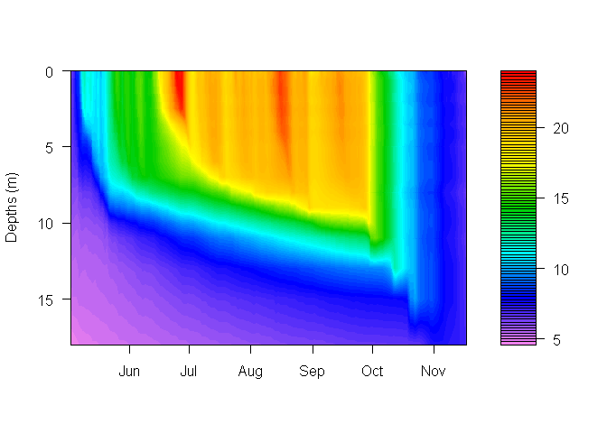

<!-- README.md is generated from README.Rmd. Please edit that file -->
[](https://travis-ci.org/GLEON/rLakeAnalyzer) [](https://cran.r-project.org/package=rLakeAnalyzer) [](https://cran.r-project.org/web/packages/rLakeAnalyzer/index.html) [](https://zenodo.org/badge/latestdoi/23404/GLEON/rLakeAnalyzer)

rLakeAnalyzer
=============

The `rLakeAnalyzer` package is an R implementation of the Lake Analyzer, a tool that allows users to calculate common metrics for lake physical states.

Installation
------------

You can install a stable version of rLakeAnalyzer with:

``` r
install.packages("rLakeAnalyzer")
```

You can install the development version rLakeAnalyzer from github with:

``` r
# install.packages("devtools")
devtools::install_github("boshek/rLakeAnalyzer")
```

Usage
-----

First the package must be loaded into R:

``` r
library(rLakeAnalyzer)
#> Warning: package 'rLakeAnalyzer' was built under R version 3.4.3
```

You can view a list of functions available in rLakeAnalyzer with:

``` r
help(package = "rLakeAnalyzer")
```

An example application of this functionality is illustrated with `wtr.heat.map()` function:

``` r
#Get the path for the package example file included
wtr.path <- system.file('extdata', 'Sparkling.daily.wtr', package="rLakeAnalyzer")

#Load data for example lake, Sparkilng Lake, Wisconsin.
sp.wtr = load.ts(wtr.path)

#Plot default figure
wtr.heat.map(sp.wtr)
```



``` r

#Change defaults supplied to filled.contour
wtr.heat.map(sp.wtr, zlim=c(0,15), plot.title="Sparkling Water Temp (C)")
```


Getting Help or Reporting an Issue
----------------------------------

To report bugs/issues/feature requests, please file an [issue](https://github.com/GLEON/rLakeAnalyzer/issues/).

These are very welcome!

Contributors
------------

Luke Winslow, Richard Woolway, Jordan Read, Jennie Brentrup, Jake Zwart, Craig Snortheim, Taylor Leach, Sam Albers, Doug Collinge
