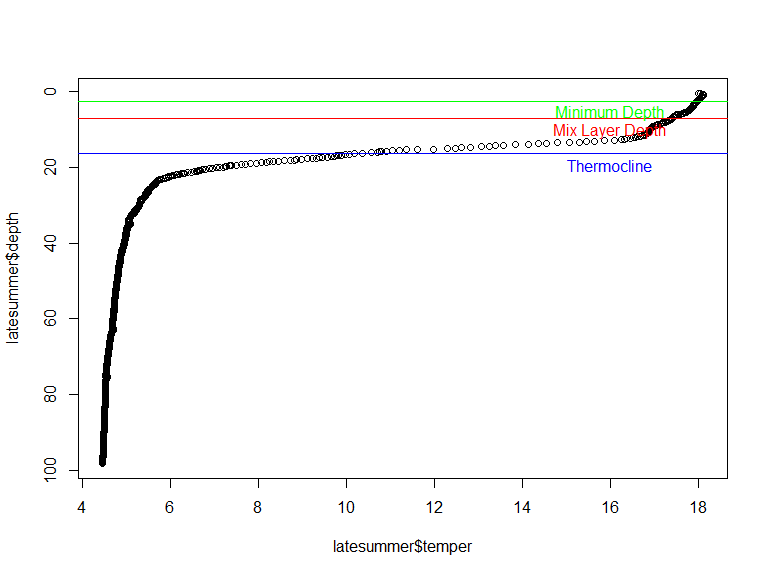
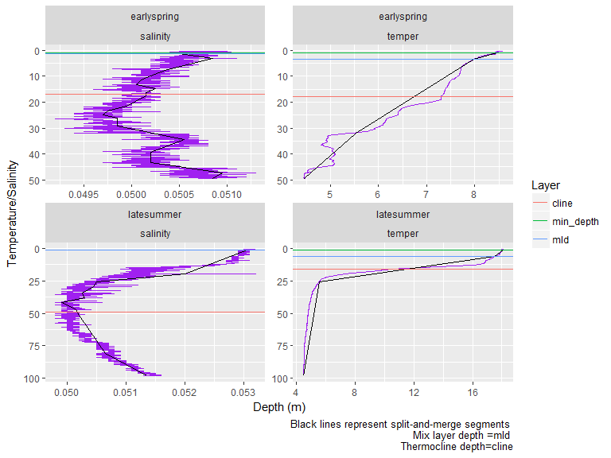

Limnotools Usage
================
Sam Albers and Doug Collinge
2017-05-05

Package loading
---------------

tidyverse is only needed for this vignette and not for the limnotools package itself though it is obviously a very useful tool.

``` r
library(dplyr)
library(tidyr)
library(purrr)
library(ggplot2)
library(knitr)
```

### Development version of limnotools

TO install limnotools, you need the devtools package installed. Then you can install limntools in R from github like this:

``` r
## rmarkdown::render('./vignettes/limnotools.Rmd')
devtools::install_github("boshek/limnotools", ref="sam_exp")
library(limnotools)
```

Split and merge algorithm
-------------------------

Water column identification is provided by the split-and-merge algorithm. Implementation of the split-and-merge algorithm for a water profile occurs within two functions:

-   wtr\_layer function
-   wtr\_segments function

Useful dataset in limnotools
----------------------------

``` r
data("earlyspring")
data("latesummer")
data("latefall")
data("t11")
```

Simple application of the split and merge algorithm
---------------------------------------------------

Below is a simple one profile example of determining key water column parameters using the split-and-merge algorithm. Most users will only use two functions that are part of the limnotools package. Cline depth and mix layer depth are calculated using the wtr\_layers() function. Coordinates for the segments of the water profile are calculated using wtr\_segments. For more information, type the following into R:

``` r
?wtr_layer
?wtr_segments
```

The default behaviour for both functions is to run the algorithm *without* specifying the number of segments. Moreover, both functions adopt as defaults the convention of a minimum depth (z0) of 2.5 m, a maximum depth (zmax) of 150 m and a error threshold (thres) of 0.1.

``` r
wldf <- wtr_layer(depth = latesummer$depth, measure = latesummer$temper)
knitr::kable(wldf)
```

|  min\_depth|  nseg|     mld|     cline|
|-----------:|-----:|-------:|---------:|
|         2.5|     4|  7.0565|  16.39025|

Note that the axes of the water column profile have been reversed and flipped to better visualize the water column and conform to standard limnological displays.

``` r
plot(y = latesummer$depth, x = latesummer$temper, ylim = rev(range(latesummer$depth)))
abline(h = wldf$cline, col='blue')
abline(h = wldf$mld, col='red')
abline(h = wldf$min_depth, col='green')
text(16, wldf$cline+3, "Thermocline", col = 'blue')
text(16, wldf$mld+3, "Mix Layer Depth", col = 'red')
text(16, wldf$min_depth+3, "Minimum Depth", col = 'green')
```



More complicated example using many datafiles
---------------------------------------------

Many users will face situations where they have multiple profiles and would like to evaluate layers and/or segments on many files. There are several approaches to this type of 'grouping' problem in R. We will use the most popular approach - dplyr - and the functionla programming tool - purrr - which is part of the [tidyverse](https://CRAN.R-project.org/package=tidyverse). To generate data for this example we first need to combine all the internal dataframes from limnotools to illustrate mix layer estimation for many casts. To simplify and decrease runtime we will only do this for temperature and salinity.

``` r
## rbind all the dataframes together
earlyspring$group <- 'earlyspring'
latesummer$group <- 'latesummer'
latefall$group <- 'latefall'
rbind_df <- dplyr::bind_rows(earlyspring, latesummer, latefall)
```

We can utilize the power of a dplyr pipe (%&gt;%) and gather to convert this data into a long form.

``` r
## Convert data into grouped format
wtrprof_df <- rbind_df %>%
  select(depth, temper, salinity, group) %>% ## only keep desired columns
  gather(variable, value, -depth, -group)  ## convert data to long format
```

Use dplyr::group\_by() and purrr::map() to run wtr\_layer() and wtr\_segment by group and variable. This outputs a list column.

``` r
safe_wtr_layer <- purrr::safely(wtr_layer)
safe_wtr_segments <-purrr::safely(wtr_segments)

wl_df <- wtrprof_df %>%  
  filter(variable == "temper") %>%
  group_by(variable, group) %>% ## group by variable and group
  nest() %>% ## create list col
  mutate(wl = map2(data, variable, ~safe_wtr_layer(depth = .$depth, measure = .$value))) %>%
  mutate(err_layer = map(wl, 'error'),
         layer_result = map(wl, 'result')) %>%
  mutate(seg = map2(data, variable, ~safe_wtr_segments(depth = .$depth, measure = .$value))) %>%
  mutate(err_seg = map(seg, 'error'),
         seg_result = map(seg, 'result')) %>%
  select(-wl, -seg) 
```

Lastly we can plot the mix layer and cline depths and segments over the water profiles using the same limnological visualization convention described above and using ggplot2 (part of the tidyverse). This example is slightly trivial but illustrate one of the ways that list-cols can be used in this context.

``` r
wl_df %>%
  select(-err_layer, -layer_result, -err_seg, -seg_result) %>%
  unnest() %>%
  ggplot(aes(x = value,y = depth)) +
  geom_path(colour = 'purple') +
  geom_path(data = unnest(select(wl_df, group, seg_result)), 
            aes(x = measure, y = depth), colour = 'black') +
  geom_point(data = unnest(select(wl_df, group, seg_result)), 
            aes(x = measure, y = depth), colour = 'black') +
  #geom_hline(data = unnest(select(wl_df, group, layer_result)), aes(yintercept = mld, colour = group)) +
  scale_y_reverse() +
  facet_wrap(~group, scales = "free_y", ncol = 1) +
  labs(y = "Temperature", x = "Depth (m)", 
       caption = "Black lines represent split-and-merge segments \n Mix layer depth =mld") +
  theme_minimal()
```


