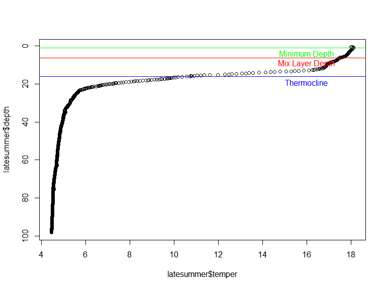

Limnotools Usage
================
Sam Albers and Doug Collinge
2017-02-07

Package loading
---------------

tidyverse is only needed for this vignette and not for the limnotools package itself though it is obviously a very useful tool.

``` r
library(tidyverse)
```

### Development version of limnotools

TO install limnotools, you need the devtools package installed. Then you can install limntools in R from github like this:

``` r
#devtools::install_github("boshek/limnotools")
devtools::install_github("boshek/limnotools", ref="sam_exp")

library(limnotools)
```

Split and merge algorithm
-------------------------

Water column identification is provided by the split-and-merge algorithm. Implementation of the split-and-merge algorithm for a water profile occurs in two parts:

-   wtr\_layer function
-   wtr\_segments function

Simple application of the split and merge algorithm
---------------------------------------------------

Below is a simple one profile example of determining key water column parameters using the split-and-merge algorithm. Most users will only use two functions that are part of the limnotools package. Cline depth and mix layer depth are calculated using the wtr\_layers() function. Coordinates for the segments of the water profile are calculated using wtr\_segments. For more information, type the following into R:

``` r
?wtr_layer
?wtr_segments
```

The default behaviour for both functions is to run the algorithm *without* specifying the number of segments. Moreover, both functions adopt as defaults the convention of a minimum depth (z0) of 2.5 m, a maximum depth (zmax) of 150 m and a error threshold (thres) of 0.1.

``` r
wldf <- wtr_layer(depth = latesummer$depth, measure = latesummer$temper)
wldf
```

    ##   min_depth nseg      mld    cline
    ## 1         1    4 6.182394 15.95489

Note that the axes of the water column profile have been reversed and flipped to better visualize the water column and conform to standard limnological displays.

``` r
plot(y = latesummer$depth, x = latesummer$temper, ylim = rev(range(latesummer$depth)))
abline(h = wldf$cline, col='blue')
abline(h = wldf$mld, col='red')
text(16, wldf$cline+3, "Thermocline", col = 'blue')
text(16, wldf$mld+3, "Mix Layer Depth", col = 'red')
```



More complicated example using many datafiles
---------------------------------------------

Many users will face situations where they have multiple profiles and would like to evaluate layers and/or segments on many files. There are several approaches to this type of 'grouping' problem in R. We will use the most popular approach - dplyr - which is part of the [tidyverse](https://CRAN.R-project.org/package=tidyverse). To generate data for this example we first need to combine all the internal dataframes from limnotools to illustrate mix layer estimation for many casts. To simplify and decrease runtime we will only do this for temperature and salinity.

``` r
## rbind all the dataframes together
earlyspring$group <- 'earlyspring'
latesummer$group <- 'latesummer'
rbind_df <- rbind(earlyspring, latesummer)
```

We can utilize the power of a dplyr pipe (%&gt;%) and gather to convert this data into a long form.

``` r
## Convert data into grouped format
wtrprof_df <- rbind_df %>%
  select(depth, temper, salinity, group) %>% ## only keep desired columns
  gather(variable, value, -depth, -group)  ## convert data to long format
```

Use group\_by() and do() to run wtr\_layer() by group and variable outputting a dataframe.

``` r
wl_df <- wtrprof_df %>%  
  group_by(variable, group) %>% ## group by variable and group
  do(wtr_layer(depth=.$depth,measure=.$value)) %>% ##do a water_layer calc
  select(-nseg) %>% ##nseg not needed here
  gather(Layer, value, -variable, -group) ##gather for plotting purposes
```

    ## Warning in cline_calc(z_seg = sam_list[["smz"]], sigma_seg =
    ## sam_list[["sms"]]): Algorithm calculates cline to be in top segment. This
    ## is likely due to surface scatter. Trying the next interval

``` r
wl_df
```

    ## Source: local data frame [12 x 4]
    ## Groups: variable, group [4]
    ## 
    ##    variable       group     Layer     value
    ##       <chr>       <chr>     <chr>     <dbl>
    ## 1  salinity earlyspring min_depth  1.000000
    ## 2  salinity  latesummer min_depth  1.000000
    ## 3    temper earlyspring min_depth  1.000000
    ## 4    temper  latesummer min_depth  1.000000
    ## 5  salinity earlyspring       mld  1.102604
    ## 6  salinity  latesummer       mld  1.326494
    ## 7    temper earlyspring       mld  3.518704
    ## 8    temper  latesummer       mld  6.182394
    ## 9  salinity earlyspring     cline 48.307158
    ## 10 salinity  latesummer     cline 38.534828
    ## 11   temper earlyspring     cline 17.713291
    ## 12   temper  latesummer     cline 15.954893

The same applies to wtr\_segments()

``` r
s_df <- wtrprof_df %>%  
  group_by(variable, group) %>% ## group by variable and group
  do(wtr_segments(depth = .$depth, measure = .$value)) ##do a water_layer calc
s_df
```

    ## Source: local data frame [42 x 6]
    ## Groups: variable, group [4]
    ## 
    ##    variable       group min_depth  nseg     depth    measure
    ##       <chr>       <chr>     <dbl> <dbl>     <dbl>      <dbl>
    ## 1  salinity earlyspring         1    19  1.012000 0.05060000
    ## 2  salinity earlyspring         1    19  1.102604 0.05056689
    ## 3  salinity earlyspring         1    19  3.035484 0.05060042
    ## 4  salinity earlyspring         1    19  7.686476 0.05015367
    ## 5  salinity earlyspring         1    19  9.800564 0.05020636
    ## 6  salinity earlyspring         1    19 10.887809 0.04994234
    ## 7  salinity earlyspring         1    19 13.122701 0.05001027
    ## 8  salinity earlyspring         1    19 14.874374 0.05020085
    ## 9  salinity earlyspring         1    19 16.807254 0.04994953
    ## 10 salinity earlyspring         1    19 18.740134 0.05002944
    ## # ... with 32 more rows

Lastly we plot the mix layer and cline depths and segments over the water profiles using the same limnological visualization convention described above and using ggplot2 (part of the tidyverse).

``` r
wtrprof_df %>%
  ggplot(aes(x = value,y = depth)) +
  geom_path(colour = 'purple') +
  geom_path(data = s_df, aes(x = measure, y = depth), colour = 'black') +
  geom_hline(data = wl_df, aes(yintercept = value, colour = Layer)) +
  scale_y_reverse() +
  facet_wrap(group~variable, scales = "free", ncol = 2) +
  labs(y = "Temperature/Salinity", x = "Depth (m)", 
       caption = "Black lines represent split-and-merge segments \n Mix layer depth =mld \n  Thermocline depth=cline")
```


